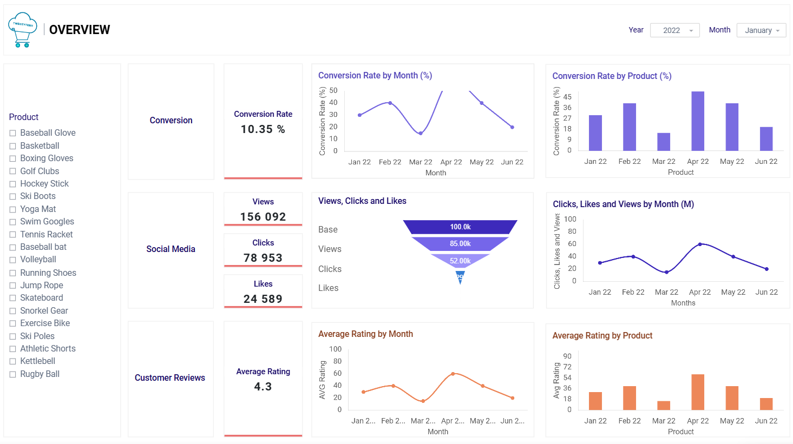
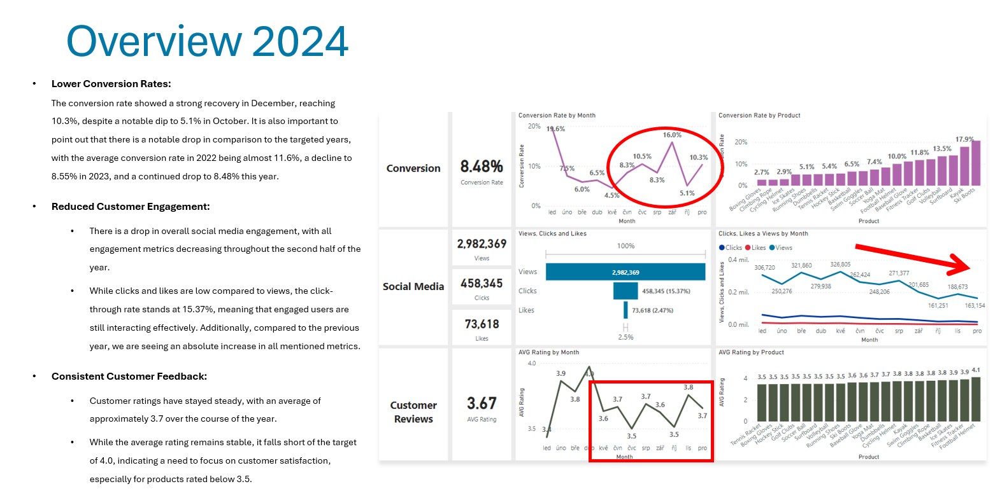
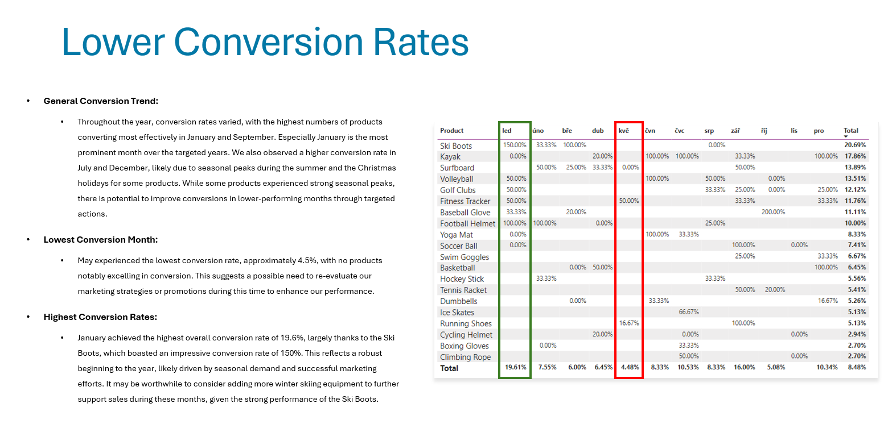
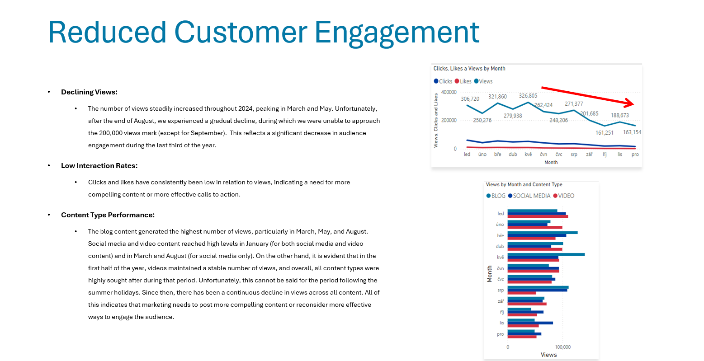
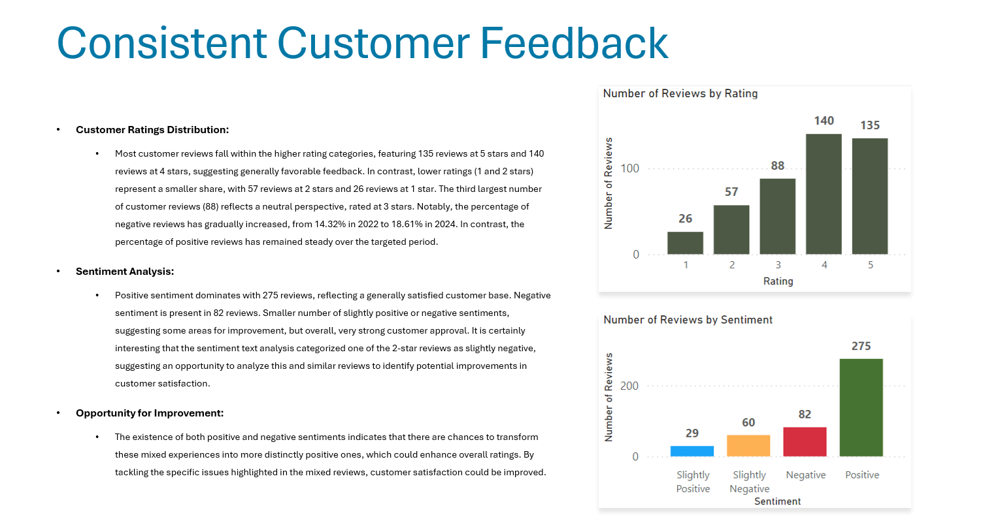
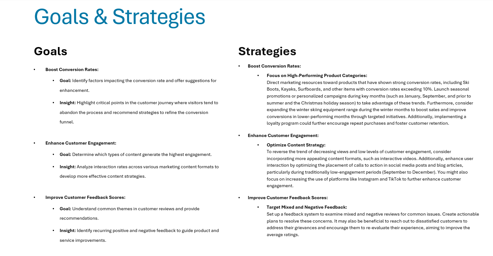

# MARKETING ANALYTICS PROJECT

<h2 style="text-align: center;">Online Shop Twentytems</h2> 

## Table of Contents

- [Intention](#intention)
  - [Goal](#goal)
  - [Solution Idea](#solution-idea)
- [Data origin](#data-origin)
- [Project Steps](#project-steps)
- [Dashboard Design](#dashboard-design)
  - [Required Dashboard Elements](#required-dashboard-elements)
  - [Dashboard Visualization](#dashboard-visualization)
  - [Tools requirements](#tools-requirements)
- [Project building - General Workflow](#project-building---general-workflow)
- [Data exploration](#data-exploration)
- [Data cleaning and testing](#data-cleaning-and-testing)
  - [Data cleaning and preparation](#data-cleaning-and-preparation)
  - [Data testing](#data-testing)
- [Visualization](#visualization)
  - [Data Visualization](#data-visualization)
  - [Measures](#measures)
- [Analysis](#analysis)
  - [Results overview](#results-overview)
  - [Scenarios ](#scenarios)
- [Conclusion](#conclusion)
  - [Findings](#findings)
  - [Recommendations](#recommendations)  

### Business Problem

#### Story:  
Part of our company, the online shop Twentytems, is experiencing a decline in completed purchases. Despite launching several new online marketing campaigns, the conversion rate continues to decrease. The marketing department is reaching out to us for assistance in conducting a detailed analysis to identify areas for improvement in their marketing strategies.

#### Key Points:  
- Lower Conversion Rates: A smaller portion of site visitors are completing purchases.
- Reduced Customer Engagement: Interactions with the website and marketing materials have decreased.
- Importance of Customer Feedback Analysis: Gaining insight into customer views on products and services is essential to boost engagement and conversions.
- High Marketing Costs: Considerable spending on marketing efforts isn’t achieving the anticipated results.

### Solution Idea
To provide the marketing department with data-driven insights, we need to define relevant metrics and KPIs for effectively analyzing and comparing customer data. Our goal is to develop a dashboard that highlights key areas for improvement and enables actionable insights.

#### Key Performance Indicators (KPIs):  

- Conversion Rate: The proportion of website visitors who complete a purchase.
- Customer Engagement Rate: Level of interaction with marketing content (clicks, likes, comments).
- Customer Feedback Score: The average rating derived from customer reviews.

#### Goals

##### Boost Conversion Rates:

- Goal: Identify factors impacting the conversion rate and offer suggestions for enhancement.
- Associated KPI: Conversion Rate.
- Insight: Highlight critical points in the customer journey where visitors tend to abandon the process and recommend strategies to refine the conversion funnel.

#####  Enhance Customer Engagement:

- Goal: Determine which types of content generate the highest engagement.
- Associated KPI: Customer Engagement Rate.
- Insight: Analyze interaction rates across various marketing content formats to develop more effective content strategies.

##### Improve Customer Feedback Scores:

- Goal: Understand common themes in customer reviews and provide recommendations.
- Associated KPI: Customer Feedback Score.
- Insight: Identify recurring positive and negative feedback to guide product and service improvements.

### Data Origin

The data will be provided by the client, specifically the marketing department of our online shop Twentytems. This includes information from various sources, such as customer reviews, social media comments, and campaign performance metrics.

**What data sets are required to achieve our goals?**

The necessary data to create a dashboard that highlights key areas and supports the marketing department in making informed decisions includes:   
- customer journey data
- customer reviews data
- engagement data

### Project Steps
- Design
- Project Development
- Data cleaning and preparation
- Visualization
- Analysis and Findings
- Conclusion

### Design

#### Dashboard Visualization

The data visuals suitable for answering our questions include:  
tables, scorecards (e.g., conversion rate, engagement metrics), bar charts, line charts, and other visualizations such as scatter plots.

**Dashboard Mockup**  

As an example, we provide just a sample design of the overview dashboard.  

#### Tools requirements
Tools required for the Process

<table>
  <tr>
    <th style="text-align: center;">Tool</th>
    <th style="text-align: center;">Reason</th>
  </tr>
  <tr>
    <td style="text-align: left;">MS Excel</td>
    <td style="text-align: left;">Data exploration</td>
  </tr>
  <tr>
    <td style="text-align: left;">MS SQL Server</td>
    <td style="text-align: left;">Data cleaning, preparation and testing</td>
  </tr>
    <tr>
    <td style="text-align: left;">Jupyter Lab</td>
    <td style="text-align: left;">Sentiment analysis</td>
  </tr>
    <tr>
    <td style="text-align: left;">Power BI</td>
    <td style="text-align: left;">Data visualization</td>
  </tr>
</table>

### Project Development

**What is the overall process for creating the solution?**  

- Data Acquisition: Gather the data supplied by the client.
- Data Exploration: Analyze the data in Excel to understand its structure and general quality.
. Data Loading: Import the data into SQL Server for further processing.
- Data Cleaning and Preparation: Employ SQL queries to cleanse and standardize the data, addressing issues such as blank spaces, null values, and duplicates.
- Data Visualization: Create visual representations of the data in Power BI or other visualization tools.
- Insights Formulation: Derive findings and conclusions based on the visualized data.
- Documentation: Create documentation to support the final findings.
- Sharing: Present the completed visualizations, recommendations, and documentation to the marketing department.
- Feedback: Collect feedback from the marketing department (client) and implement any necessary adjustments to the project. This typically requires revisiting earlier steps and should be integrated into every phase of the process.

### Data Cleaning and Preparation

### Visualization

#### Data Visualization

#### DAX Measures

### Analysis and Findings

#### Overview 2024

#### Lower Conversion Rates

#### Reduced Customer Engagement

#### Consistent Customer Feedback

### Conclusion

