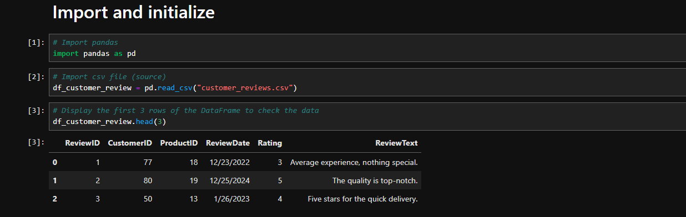
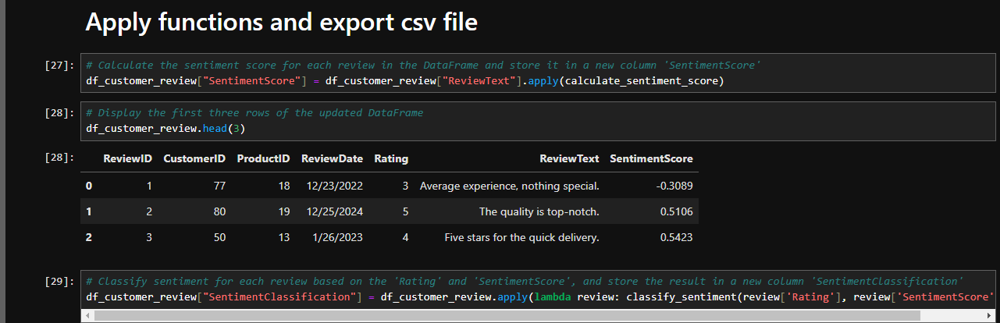

<h1 style="text-align: center;">Customer Conversion and Engagement Analysis</h1> 
<h2 style="text-align: center;">Online Shop Twentytems</h2> 

## Table of Contents

- [Business Problem](#business-problem)
  - [Story](#story)
  - [Key Points](#key-points)
- [Solution Idea](#solution-idea)
  - [Key Performance Indicators](#key-performance-indicators)
  - [Goals](#goals)
- [Data origin](#data-origin)
- [Project Steps](#project-steps)
- [Dashboard Design](#dashboard-design)
  - [Dashboard Visualization](#dashboard-visualization)
  - [Tools requirements](#tools-requirements)
- [Project Development](#project-development)
- [Data exploration](#data-exploration)
- [Data cleaning and Preparation](#data-cleaning-and-preparation)
  - [Data Cleaning and Preparation in SQL](#data-cleaning-and-preparation-in-sql)
  - [Data Enrichment in Python - Sentiment Analysis](#data-enrichment-in-python---sentiment-analysis)
- [Visualization](#visualization)
  - [Data Visualization](#data-visualization)
  - [DAX Measures](#dax-measures)
- [Analysis and Findings](#analysis-and-findings)
  - [Overview 2024](#overview-2024)
  - [Lower Conversion Rates](#lower-conversion-rates)
  - [Reduced Customer Engagement](#reduced-customer-engagement)
  - [Consistent Customer Feedback](#consistent-customer-feedback)
- [Conclusion](#conclusion)
  - [Findings](#findings)
  - [Recommendations](#recommendations)  

### Business Problem

#### Story:  
Part of our company, the online shop Twentytems, is experiencing a decline in completed purchases. Despite launching several new online marketing campaigns, the conversion rate continues to decrease. The marketing department is reaching out to us for assistance in conducting a detailed analysis to identify areas for improvement in their marketing strategies.

#### Key Points:  
- Lower Conversion Rates: A smaller portion of site visitors are completing purchases.
- Reduced Customer Engagement: Interactions with the website and marketing materials have decreased.
- Importance of Customer Feedback Analysis: Gaining insight into customer views on products and services is essential to boost engagement and conversions.
- High Marketing Costs: Considerable spending on marketing efforts isn’t achieving the anticipated results.

### Solution Idea
To provide the marketing department with data-driven insights, we need to define relevant metrics and KPIs for effectively analyzing and comparing customer data. Our goal is to develop a dashboard that highlights key areas for improvement and enables actionable insights.

#### Key Performance Indicators (KPIs):  

- Conversion Rate: The proportion of website visitors who complete a purchase.
- Customer Engagement Rate: Level of interaction with marketing content (clicks, likes, comments).
- Customer Feedback Score: The average rating derived from customer reviews.

#### Goals

##### Boost Conversion Rates:

- Goal: Identify factors impacting the conversion rate and offer suggestions for enhancement.
- Associated KPI: Conversion Rate.
- Insight: Highlight critical points in the customer journey where visitors tend to abandon the process and recommend strategies to refine the conversion funnel.

#####  Enhance Customer Engagement:

- Goal: Determine which types of content generate the highest engagement.
- Associated KPI: Customer Engagement Rate.
- Insight: Analyze interaction rates across various marketing content formats to develop more effective content strategies.

##### Improve Customer Feedback Scores:

- Goal: Understand common themes in customer reviews and provide recommendations.
- Associated KPI: Customer Feedback Score.
- Insight: Identify recurring positive and negative feedback to guide product and service improvements.

### Data Origin

The data will be provided by the client, specifically the marketing department of our online shop Twentytems. This includes information from various sources, such as customer reviews, social media comments, and campaign performance metrics.

**What data sets are required to achieve our goals?**

The necessary data to create a dashboard that highlights key areas and supports the marketing department in making informed decisions includes:   
- customer journey data
- customer reviews data
- engagement data

### Project Steps
- Dashboard Design
- Project Development
- Data Cleaning and Preparation
- Visualization
- Analysis and Findings
- Conclusion

### Dashboard Design

#### Dashboard Visualization

The data visuals suitable for answering our questions include:  
tables, scorecards (e.g., conversion rate, engagement metrics), bar charts, line charts, and other visualizations such as scatter plots.

**Dashboard Mockup**  

As an example, we provide just a sample design of the overview dashboard.  

#### Tools requirements
Tools required for the Process

<table>
  <tr>
    <th style="text-align: center;">Tool</th>
    <th style="text-align: center;">Reason</th>
  </tr>
  <tr>
    <td style="text-align: left;">MS Excel</td>
    <td style="text-align: left;">Data exploration</td>
  </tr>
  <tr>
    <td style="text-align: left;">MS SQL Server</td>
    <td style="text-align: left;">Data cleaning, preparation and testing</td>
  </tr>
    <tr>
    <td style="text-align: left;">Jupyter Lab</td>
    <td style="text-align: left;">Sentiment analysis</td>
  </tr>
    <tr>
    <td style="text-align: left;">Power BI</td>
    <td style="text-align: left;">Data visualization</td>
  </tr>
</table>

### Project Development

**What is the overall process for creating the solution?**  

- Data Acquisition: Gather the data supplied by the client.
- Data Exploration: Analyze the data in Excel to understand its structure and general quality.
. Data Loading: Import the data into SQL Server for further processing.
- Data Cleaning and Preparation: Employ SQL queries to cleanse and standardize the data, addressing issues such as blank spaces, null values, and duplicates.
- Data Visualization: Create visual representations of the data in Power BI or other visualization tools.
- Insights Formulation: Derive findings and conclusions based on the visualized data.
- Documentation: Create documentation to support the final findings.
- Sharing: Present the completed visualizations, recommendations, and documentation to the marketing department.
- Feedback: Collect feedback from the marketing department (client) and implement any necessary adjustments to the project. This typically requires revisiting earlier steps and should be integrated into every phase of the process.

### Data Cleaning and Preparation

The goal is to refine our dataset to ensure it is well-organized and ready for analysis.  

The cleaned data should meet these standards and constraints:  

- Retain only the necessary columns.
- Eliminate any duplicate entries within the relevant columns.
- Standardize the data by renaming columns, ensuring clear identifiers, etc.
- Ensure each column’s data type is appropriate for the content it holds.
- No column should contain null or blank values.
  
**Steps for Data Cleaning, Modification, and Export to the Required Format:**

- Remove duplicates
- Standardize the data
- Eliminate null or blank values
- Remove unnecessary columns

#### Data Cleaning and Preparation in SQL

We provide verification only for the processing of source data on the Customer Journey, as it was not necessary for the others.  

**Customer Journey - Verification Data**

**Customer Journey - Final Selection**

**Customer Reviews  - Final Selection**  

**Customer Geography  - Final Selection**  

**Engagement Data  - Final Selection**  

**Products  - Final Selection**  

  

#### Data Enrichment in Python - Sentiment Analysis

**1) Import Source Data and Pandas Library**  

  

**2) Import NLTK Library and Initialize the Analyzer Tool**  

  

**3) Test the Analyzer Tool**  

  

**4) Define Functions for Sentiment Analysis**  

  

**5) Apply Sentiment Analysis Functions**  

  

**6) Export Results to CSV**  

  

**7) View Exported Document**  

  

### Visualization

#### Data Visualization  

The Power BI dashboards include separate views for each area: Overview, Conversion Rate Details, Social Media Insights, and Customer Review Details.  

- **Overview**  

  

- **Conversion Rate Details**  

  

- **Social Media Details**

  

- **Customer Review Details**

  

#### DAX Measures

We present only selected, more complex DAX (Power BI) measures.  

- Conversion Rate  

  

- Proportion of Positive Reviews  

  

- Proportion of Negative Reviews  

  

### Analysis and Findings

#### Overview 2024

- **Lower Conversion Rates:**  
The conversion rate showed a strong recovery in December, reaching 10.3%, despite a notable dip to 5.1% in October. It is also important to point out that there is a notable drop in comparison to the targeted years, with the average conversion rate in 2022 being almost 11.6%, a decline to 8.55% in 2023, and a continued drop to 8.48% this year.

- **Reduced Customer Engagement:**  
There is a drop in overall social media engagement, with all engagement metrics decreasing throughout the second half of the year.
While clicks and likes are low compared to views, the click-through rate stands at 15.37%, meaning that engaged users are still interacting effectively. Additionally, compared to the previous year, we are seeing an absolute increase in all mentioned metrics.  

- **Consistent Customer Feedback:**  
Customer ratings have stayed steady, with an average of approximately 3.7 over the course of the year.
While the average rating remains stable, it falls short of the target of 4.0, indicating a need to focus on customer satisfaction, especially for products rated below 3.5.

  

#### Lower Conversion Rates

- **General Conversion Trend:**  
Throughout the year, conversion rates varied, with the highest numbers of products converting most effectively in January and September. Especially January is the most prominent month over the targeted years. We also observed a higher conversion rate in July and December, likely due to seasonal peaks during the summer and the Christmas holidays for some products. While some products experienced strong seasonal peaks, there is potential to improve conversions in lower-performing months through targeted actions.

- **Lowest Conversion Month:**  
May experienced the lowest conversion rate, approximately 4.5%, with no products notably excelling in conversion. This suggests a possible need to re-evaluate our marketing strategies or promotions during this time to enhance our performance.

- **Highest Conversion Rates:**  
January achieved the highest overall conversion rate of 19.6%, largely thanks to the Ski Boots, which boasted an impressive conversion rate of 150%. This reflects a robust beginning to the year, likely driven by seasonal demand and successful marketing efforts. It may be worthwhile to consider adding more winter skiing equipment to further support sales during these months, given the strong performance of the Ski Boots.  

  

#### Reduced Customer Engagement

- **Declining Views:**  
The number of views steadily increased throughout 2024, peaking in March and May. Unfortunately, after the end of August, we experienced a gradual decline, during which we were unable to approach the 200,000 views mark (except for September).  This reflects a significant decrease in audience engagement during the last third of the year.  

- **Low Interaction Rates:**  
Clicks and likes have consistently been low in relation to views, indicating a need for more compelling content or more effective calls to action.  

- **Content Type Performance:**  
The blog content generated the highest number of views, particularly in March, May, and August. Social media and video content reached high levels in January (for both social media and video content) and in March and August (for social media only). On the other hand, it is evident that in the first half of the year, videos maintained a stable number of views, and overall, all content types were highly sought after during that period. Unfortunately, this cannot be said for the period following the summer holidays. Since then, there has been a continuous decline in views across all content. All of this indicates that marketing needs to post more compelling content or reconsider more effective ways to engage the audience.  

  

#### Consistent Customer Feedback

- **Customer Ratings Distribution:**  
Most customer reviews fall within the higher rating categories, featuring 135 reviews at 5 stars and 140 reviews at 4 stars, suggesting generally favorable feedback. In contrast, lower ratings (1 and 2 stars) represent a smaller share, with 57 reviews at 2 stars and 26 reviews at 1 star. The third largest number of customer reviews (88) reflects a neutral perspective, rated at 3 stars. Notably, the percentage of negative reviews has gradually increased, from 14.32% in 2022 to 18.61% in 2024. In contrast, the percentage of positive reviews has remained steady over the targeted period.  

- **Sentiment Analysis:**  
Positive sentiment dominates with 275 reviews, reflecting a generally satisfied customer base. Negative sentiment is present in 82 reviews. Smaller number of slightly positive or negative sentiments, suggesting some areas for improvement, but overall, very strong customer approval. It is certainly interesting that the sentiment text analysis categorized one of the 2-star reviews as slightly negative, suggesting an opportunity to analyze this and similar reviews to identify potential improvements in customer satisfaction.

- **Opportunity for Improvement:**  
The existence of both positive and negative sentiments indicates that there are chances to transform these mixed experiences into more distinctly positive ones, which could enhance overall ratings. By tackling the specific issues highlighted in the mixed reviews, customer satisfaction could be improved.  

  

### Conclusion

#### Goals

##### Boost Conversion Rates:

- **Goal:** Identify factors impacting the conversion rate and offer suggestions for enhancement.  
- **Insight:** Highlight critical points in the customer journey where visitors tend to abandon the process and recommend strategies to refine the conversion funnel.  

##### Enhance Customer Engagement:

- **Goal:** Determine which types of content generate the highest engagement.  
- **Insight:** Analyze interaction rates across various marketing content formats to develop more effective content strategies.

##### Improve Customer Feedback Scores

- **Goal:** Understand common themes in customer reviews and provide recommendations.  
- **Insight:** Identify recurring positive and negative feedback to guide product and service improvements.  

These goals collectively aim to enhance the overall customer experience and drive business growth.  

#### Strategies

##### Boost Conversion Rates:

- **Focus on High-Performing Product Categories:**  
Direct marketing resources toward products that have shown strong conversion rates, including Ski Boots, Kayaks, Surfboards, and other items with conversion rates exceeding 10%. Launch seasonal promotions or personalized campaigns during key months   (such as January, September, and prior to summer and the Christmas holiday season) to take advantage of these trends. Furthermore, consider expanding the winter skiing equipment range during the winter months to boost sales and improve conversions in lower-performing months through targeted initiatives. Additionally, implementing a loyalty program could further encourage repeat purchases and foster customer retention.  

##### Enhance Customer Engagement:

- **Optimize Content Strategy:**  
To reverse the trend of decreasing views and low levels of customer engagement, consider incorporating more appealing content formats, such as interactive videos. Additionally, enhance user interaction by optimizing the placement of calls to action in social media posts and blog articles, particularly during traditionally low-engagement periods (September to December). You might also focus on increasing the use of platforms like Instagram and TikTok to further enhance customer engagement.  

##### Improve Customer Feedback Scores:

- **Target Mixed and Negative Feedback:**  
Set up a feedback system to examine mixed and negative reviews for common issues. Create actionable plans to resolve these concerns. Additionally, reaching out to dissatisfied customers to address their grievances may encourage them to re-evaluate their experience, with the ultimate goal of improving average ratings to 4 and above.

